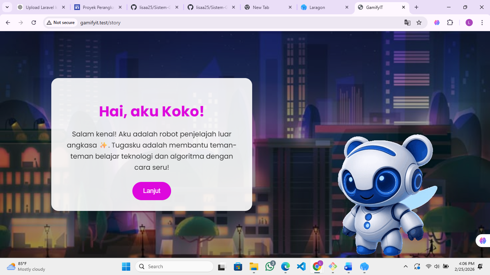
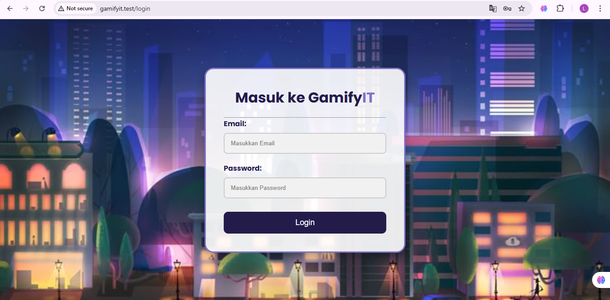

# 🎮 Sistem Pembelajaran Berbasis Gamifikasi
### (Laravel Web Application)

## 📌 Deskripsi

Sistem Pembelajaran Berbasis Gamifikasi merupakan aplikasi web yang dikembangkan menggunakan framework Laravel. Sistem ini dirancang untuk meningkatkan motivasi dan keterlibatan siswa dalam proses pembelajaran melalui penerapan elemen gamifikasi seperti poin, level, badge, dan leaderboard.

Aplikasi ini mendukung peran Guru, dan Siswa dengan fitur manajemen materi, kuis, serta sistem penghargaan berbasis pencapaian.

---

## 🚀 Fitur Utama

- 🔐 Login Multi Role (Guru, Siswa)
- 🏆 Sistem Poin Otomatis
- 🎖 Sistem Badge / Lencana
- 📊 Leaderboard Peringkat
- 📚 Manajemen Materi
- 📝 Manajemen Kuis
- 👤 Manajemen Profil Pengguna
- 🎯 Sistem Level Pembelajaran

---

## 🛠 Teknologi yang Digunakan

- PHP
- Laravel
- MySQL
- Bootstrap / CSS
- JavaScript

---

## 🖼 Tampilan Sistem

### 🔐 Tampilan Awal

### 🔐 Halaman Story

### 🔐 Halaman Login

### 📊 Dashboard Siswa

### 🏆 Leaderboard

### 🎖 Profil Siswa

---
